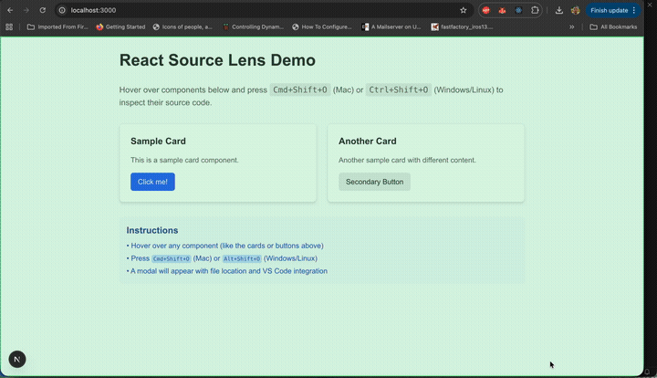

# React Source Lens

Instantly locate any React component's source code with a single keystroke. Hover + `Cmd+Shift+O` (Mac) or `Alt+Shift+O` (Windows/Linux) = your editor opens the exact file and line.



## Installation

```bash
npm install react-source-lens
```

## Usage

### 1. Import and use the hook

```jsx
import { useReactSourceLens } from 'react-source-lens';

// Basic usage
useReactSourceLens();

// With VS Code integration (recommended)
useReactSourceLens({
  projectRoot: '/path/to/your/project' // Absolute path to your project root
});
```

### 2. Configure Babel plugin (optional, for better source detection)

Add the Babel plugin to your `.babelrc` or `babel.config.js`:

```json
{
  "plugins": [
    "react-source-lens/babel-plugin"
  ]
}
```

Or in JavaScript config:

```js
module.exports = {
  plugins: [
    'react-source-lens/babel-plugin'
  ]
};
```

### 3. Usage in development

1. The overlay will be **visible by default** when the hook is active
2. **Hover** over any React component in your app
3. **Press** `Cmd+Shift+O` (Mac) or `Alt+Shift+O` (Windows/Linux) to inspect source location
4. **Press** `Cmd+Shift+L` (Mac) or `Ctrl+Shift+L` (Windows/Linux) to **toggle the overlay on/off**

When source information is found, a **modal popup** will appear with:
- **File and line number** information
- **"Open in VS Code"** button to jump directly to the component in your editor
- **"Copy Path"** button to copy the file path to clipboard
- **Close button** (×) or press **Escape** to dismiss

The modal automatically disappears after 10 seconds.

## How it works

React Source Lens uses React's internal fiber nodes and debug information to locate the source code of components. It works best when:

- React is in development mode
- Components have debug source information (enabled by default in Create React App and Vite)
- The Babel plugin is configured to add source attributes to JSX elements

### Next.js Compatibility

**Next.js uses SWC by default**, which doesn't support custom Babel plugins. To use React Source Lens with Next.js, you need to configure it to use Babel instead.

1. **Create a `.babelrc` file** in your Next.js project root:

   ```json
   {
     "presets": ["next/babel"],
     "plugins": ["react-source-lens/babel-plugin"]
   }
   ```

2. **Create a Client Component** to initialize React Source Lens:
   ```tsx
   // components/ReactSourceLensProvider.tsx
   'use client';

   import { useReactSourceLens } from 'react-source-lens';

   export function ReactSourceLensProvider() {
     useReactSourceLens({
       projectRoot: '/absolute/path/to/your/nextjs/project'
     });

     return null;
   }
   ```

3. **Add the provider to your root layout** (`app/layout.tsx`):
   ```tsx
   import { ReactSourceLensProvider } from '@/components/ReactSourceLensProvider';

   export default function RootLayout({
     children,
   }: {
     children: React.ReactNode;
   }) {
     return (
       <html lang="en">
         <body>
           <ReactSourceLensProvider />
           {children}
         </body>
       </html>
     );
   }
   ```

**Note**: The Babel plugin now automatically detects Next.js App Router directory structures (`app/` directory) and provides correct relative paths for source code inspection.
### 4. Run tests

```bash
# Run tests in watch mode
npm test

# Run tests once
npm run test:run

# Run tests with UI
npm run test:ui
```

## How it works

### `useReactSourceLens(options?)`

A React hook that enables source code inspection for the current React tree. Call this once at the root of your app in development mode.

#### Options

- `projectRoot?: string` - Absolute path to your project root directory. Required for VS Code integration to work properly. Example: `'/Users/username/projects/my-app'`
- `editor?: string` - Editor to open files in. Supports: `'vscode'`, `'webstorm'`, `'intellij'`, `'atom'`, `'sublime'`, `'cursor'`, `'windsurf'`. Defaults to auto-detection or VS Code.

#### Editor Auto-Detection

React Source Lens automatically detects your editor by checking:
1. `REACT_EDITOR` environment variable
2. `EDITOR` environment variable  
3. Falls back to VS Code if no editor is detected

#### Supported Editors

| Editor | Configuration Value | URL Scheme |
|--------|---------------------|------------|
| VS Code | `'vscode'` or `'code'` | `vscode://file/path:line` |
| WebStorm/IntelliJ | `'webstorm'` or `'intellij'` | `jetbrains://idea/navigate/...` |
| Atom | `'atom'` | `atom://core/open/file?...` |
| Sublime Text | `'sublime'` | `subl://open?url=file://...` |
| Cursor | `'cursor'` | `cursor://file/path:line` |
| **Windsurf** | `'windsurf'` | `windsurf://file/path:line` |

#### Example

```jsx
// Auto-detect editor (recommended)
useReactSourceLens({
  projectRoot: '/Users/username/projects/my-app'
});

// Explicitly specify editor
useReactSourceLens({
  projectRoot: '/Users/username/projects/my-app',
  editor: 'windsurf' // or 'vscode', 'webstorm', 'atom', 'sublime', 'cursor'
});

// Minimal setup (auto-detects everything)
useReactSourceLens();
```

## License

MIT
